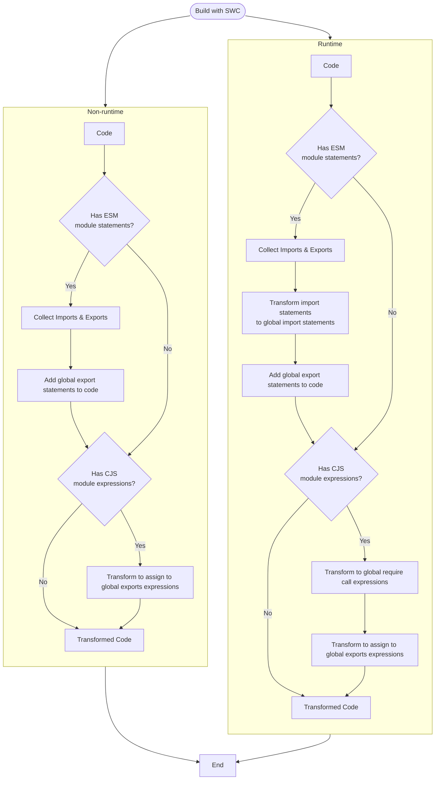
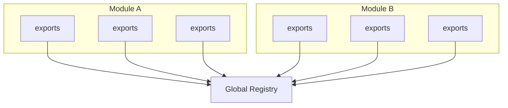
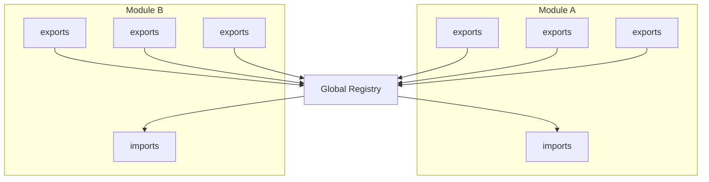

# Mechanisms



## Non-runtime



This mode will be added global export statements only.

It is appropriate to enable this option when first bundling because modules contained inside the bundle can be registered to the global module registry.

Non-runtime mode can be enabled with `runtimeModule: false`.

```ts
// ESM
import App from '@app/core';
import { services } from '@app/services';
import * as helpers from '@app/helpers';

const app = new App();

export function initialize() {
  // ...
};

export default app;
```

```ts
// CJS
const App = require('@app/core');
const { services } = require('@app/services');
const helpers = require('@app/helpers');

const app = new App();

exports.initialize = function() {
  // ...
};

module.exports = app;
```

To

```diff
import App, { services } from '@app/core';
import * as helpers from '@app/helpers';

const app = new App();

export function initialize() {
  // ...
};

export default app;

+ global.__modules.esm('main.ts', {
+   default: app,
+   initialize,
+ });
```

```diff
+ const __cjs = global.__modules.cjs("main.ts");
const App = require('@app/core');
const { services } = require('@app/services');
const helpers = require('@app/helpers');

const app = new App();

- exports.initialize = function() {
+ exports.initialize = __cjs.exports.initialize = function() {
  // ...
};

- module.exports = app;
+ module.exports = __cjs.exports.default = app;
```

Original module statements will be handled by bundlers(like an esbuild).

## Runtime



This mode will be transform `import` and `require` statements into global module apis(and also including adding global export statements).

It is appropriate to enable this option when need to apply changes on runtime like a HMR(Hot Module Replacement).

Runtime mode can be enabled with `runtimeModule: true`.

```ts
// ESM
import App from '@app/core';
import { services } from '@app/services';
import * as helpers from '@app/helpers';

const app = new App();

export function initialize() {
  // ...
};

export default app;
```

```ts
// CJS
const App = require('@app/core');
const { services } = require('@app/services');
const helpers = require('@app/helpers');

const app = new App();

exports.initialize = function() {
  // ...
};

module.exports = app;
```

To

```diff
- import App from '@app/core';
- import { services } from '@app/services';
- import * as helpers from '@app/helpers';
+ const __app_core = global.__modules.import('@app/core');
+ const __app_services = global.__modules.import('@app/services');
+ const __app_helpers = global.__modules.import('@app/helpers');
+ const App = __app_core.default;
+ const services = __app_services.services;
+ const helpers = global.__modules.helpers.asWildcard(__app_helpers);

const app = new App();

function initialize() {
  // ...
}

- export default app;
+ const __export_default = app;

+ global.__modules.esm('demo.tsx', {
+   default: __export_default,
+   initialize,
+ });
```

```diff

- const App = require('@app/core');
- const { services } = require('@app/services');
- const helpers = require('@app/helpers');

const app = new App();

exports.initialize = function() {
  // ...
};

module.exports = app;

+ const __cjs = global.__modules.cjs('demo.tsx');
- const App = require('@app/core');
- const { services } = require('@app/services');
- const helpers = require('@app/helpers');
+ const App = global.__modules.require('@app/core');
+ const { services } = global.__modules.require('@app/services');
+ const helpers = global.__modules.require('@app/helpers');

const app = new App();

- exports.initialize = function() {
+ exports.initialize = __cjs.exports.initialize = function() {
  // ...
};

- module.exports = app;
+ module.exports = __cjs.exports.default = app;
```

When running sources on runtime, now `import` and `require` other modules from the global module registry.
